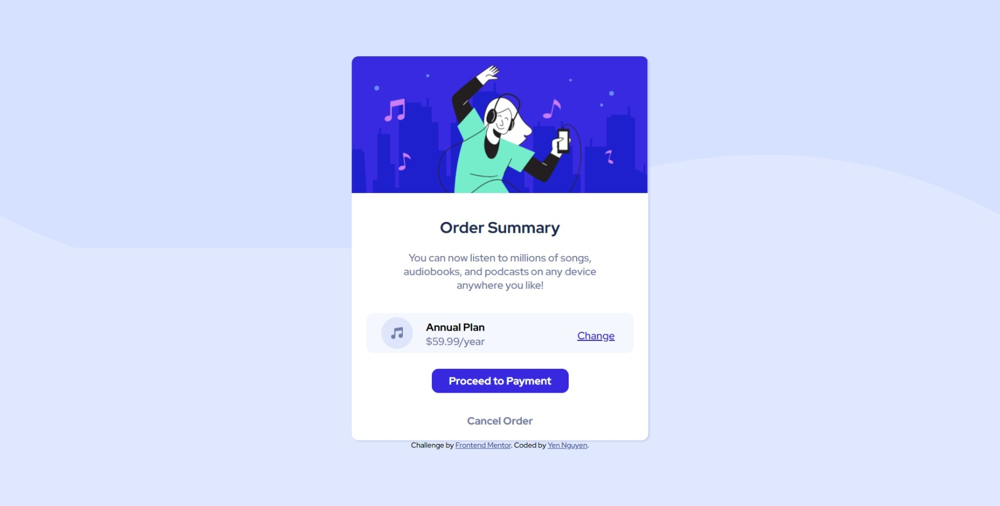

# Frontend Mentor - Order summary card solution

This is a solution to the [Order summary card challenge on Frontend Mentor](https://www.frontendmentor.io/challenges/order-summary-component-QlPmajDUj). Frontend Mentor challenges help you improve your coding skills by building realistic projects. 

## Table of contents

- [Overview](#overview)
  - [The challenge](#the-challenge)
  - [Screenshot](#screenshot)
  - [Links](#links)
- [My process](#my-process)
  - [Built with](#built-with)
  - [What I learned](#what-i-learned)
  - [Continued development](#continued-development)
  - [Useful resources](#useful-resources)
- [Author](#author)
- [Acknowledgments](#acknowledgments)

**Note: Delete this note and update the table of contents based on what sections you keep.**

## Overview

### The challenge

Users should be able to:

- See hover states for interactive elements

### Screenshot




### Links

- Solution URL: https://github.com/yenpnguyen/order-summary-card
- Live Site URL: https://yenpnguyen.github.io/order-summary-card/index.html

## My process
I worked from top to the bottom with css. I mainly used flex boxes to display and style my contents.

### Built with

- Semantic HTML5 markup
- CSS custom properties
- Flexbox
- CSS Grid
- Mobile-first workflow

### What I learned

I had some trouble setting up the background image. But I watched a youtube video to learn about overlay, and I was able to get my solution as close to the model as possible.
I also learned to use media queries for responsive designing. This is a big step for me because it really helped bring the webpage together.

To see how you can add code snippets, see below:

```html
<!DOCTYPE html>
<html lang="en">
<head>
  <meta charset="UTF-8">
  <meta name="viewport" content="width=device-width, initial-scale=1.0"> <!-- displays site properly based on user's device -->

  <link rel="icon" type="image/png" sizes="32x32" href="./images/favicon-32x32.png">
  <link rel="stylesheet" href="./css/index.css">
  <link rel="preconnect" href="https://fonts.googleapis.com">
  <link rel="preconnect" href="https://fonts.gstatic.com" crossorigin>
  <link href="https://fonts.googleapis.com/css2?family=Red+Hat+Display:wght@500;700;900&display=swap" rel="stylesheet">
  <title>Frontend Mentor | Order summary card</title>

  <!-- Feel free to remove these styles or customise in your own stylesheet 👍 -->
  <style>
    .attribution { font-size: 11px; text-align: center; }
    .attribution a { color: hsl(228, 45%, 44%); }
  </style>
</head>
<body>  
  <div class="bg__img"></div>
  <!-- summary card container -->
  <section class="summary-container">
    <!-- Logo -->
    <div class="hero-img" ></div>
    <!-- End of Logo -->

    <!-- order summary -->
    <div class="order-summary">
    <!-- summary -->
      <h1>Order Summary</h1>  
      <p>You can now listen to millions of songs, audiobooks, and podcasts on any device anywhere you like!</p>  
    </div>
    <!-- end of order summary -->

    <!-- pricing -->
    <div class="pricing">
      <article>
        
        <div class="annual-rate">
          <h4>Annual Plan</h4> 
          <p>$59.99/year</p>  
        </div>
      </article>
      <button class="btn btn-change">Change</button> 
    </div>
    <!-- end of pricing -->

    <!-- buttons -->
    <a href="./index.html" class=" btn btn-payment">Proceed to Payment</a>
    <a href="./index.html" class=" btn btn-cancel">Cancel Order</a>

    <!-- end of buttons -->
  </section>
  <!-- end of summary card container -->
<div class="attribution">
    Challenge by <a href="https://www.frontendmentor.io?ref=challenge" target="_blank">Frontend Mentor</a>. 
    Coded by <a href="#">Yen Nguyen</a>.
</div> 
</body>
</html>
```
```css
body{
    background: hsl(225, 100%, 94%);
    font-family: 'Red Hat Display', sans-serif;
    font-size: 16px;
    display: flex;
    flex-direction: column;
    justify-content: center;
    align-items: center;
    min-height: 100vh;
}

.btn {
    margin-top: 0.5rem;
    font-family: inherit;
    font-size: inherit;
    align-items: center;
    transition: all 0.2s ease-in-out;
}

.bg__img{
    background:url("../images/pattern-background-mobile.svg") no-repeat center/cover;
    height: 400px;
    position: absolute;
    top: 0;
    left:0;
    right:0;
    left:0;
    z-index: -1;
}
.summary-container{
    display: flex;
    flex-direction: column;
    width: 80%;
    height: 95%; 
    justify-content: center;
    align-items: center;
    background: white;
    border-radius: 10px;
    box-shadow: 2px 2px 2px hsl(228, 45%, 44%, 0.15);
}
.hero-img {
    height: 13rem;
    width: 100%;
    background: url('../images/illustration-hero.svg') center/cover no-repeat;
    border-top-left-radius: 10px;
    border-top-right-radius: 10px;
}
@media screen and (min-width:1000px) {
    .bg__img{
    background:url("../images/pattern-background-desktop.svg") no-repeat center/cover;
    height: 50vh;
    }
    .summary-container{
        display: flex;
        flex-direction: column;
        width: 30%;
        height: 95%; 
        justify-content: center;
        align-items: center; 
        background: white;
        border-radius: 10px;
    }
}
/* order summary */
.order-summary{
    text-align: center;
    width: 80%;
    margin-top: 1rem;
}
h1{
    color: hsl(223, 47%, 23%);
}
.order-summary p{
    color:hsl(224, 23%, 55%);
}
/* -- -- */

/* --pricing-- */
.pricing{
    display: flex;
    background: hsl(225, 100%, 98%);
    width: 80%;
    padding: 0 5%;
    border-radius: 10px;
    margin: 1rem auto;
    align-items: center;
    justify-content: space-between;
    line-height: 1px;
    }
.pricing article {
    display: flex;
    align-items: center;
    justify-content: center;
}

.pricing article img {
    object-fit: none;
    margin-right: 20px;
}
.annual-rate {
    font-family: 'Red Hat Display', sans-serif;
    font-size: 16px;    
}
.annual-rate p {
    color:hsl(224, 23%, 55%);
}

.btn-change {
    border:none;
    background: transparent;
    color: hsl(245, 75%, 52%);
    text-decoration: underline;
}
.btn-change:hover {
    text-decoration: none;
    cursor: pointer;
}
/* -- -- */

/* --button-- */
.btn-payment{
    display: grid;
    text-decoration: none;
    border-radius: 10px;
    padding: 0.5rem 0;
    margin-bottom: 1.5rem;
    width: 13rem;
    background: hsl(245, 75%, 52%);
    color: white;
    border: none;
    font-weight: 700;
    place-items: center;    
}

.btn-payment:hover{
    opacity: 0.8;
}

.btn-cancel{
    display: grid;
    text-decoration: none;
    background: transparent;
    color: hsl(224, 23%, 55%);
    border: none;
    margin-bottom: 1.5rem;
    height: 1rem;
    font-weight: 700;
}
.btn-cancel:hover{
    color: hsl(223, 47%, 23%);
}
/* -- -- */
```


### Continued development
I wish I had utilized variables when styling with css. I noticed myself reusing the same styles for many components, such as buttons. It would have been more effective if I had used variables for the same styling that can be applied to multiple components. 
For my next project, I'll focus on making my webpage interactive.


### Useful resources

- [Example resource 1](https://www.youtube.com/watch?v=-8LTPIJBGwQ&list=PLJ48xwOOHjCJF-UPktJA8KE9ImnHFEjB0&index=2&t=3061s) - this video helped me learn the "mobile-first" workflow and many styling techniques.

## Author
- Frontend Mentor - [@yenpnguyen] https://www.frontendmentor.io/profile/yenpnguyen

